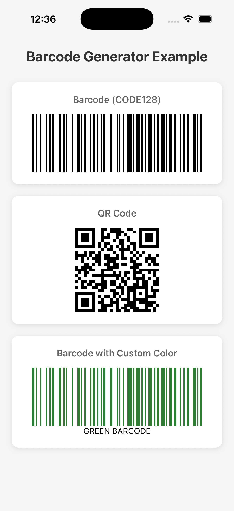

# react-native-barcode-qr-generator

<div align="center">
  
  
  
  
  
  

  <br/>
  <br/>

  
</div>

<br/>

Modern, **TypeScript-first**, SVG-based barcode and QR code generator for React Native. This library provides a high-performance way to generate sharp, scanable codes that work flawlessly on both iOS and Android.

---

## 🌟 Key Features

- **⚛️ New Architecture Ready**: Fully compatible with the Fabric renderer and TurboModules.
- **✅ Optimized for Mobile**: Precision-calculated SVG paths ensure perfect scanning even for long strings on Android.
- **⚡ Built with SVG**: Powered by `react-native-svg` for crisp, resolution-independent rendering.
- **🛡️ Custom QR Engine**: Robust internal QR generator with support for variable capacity and Error Correction Levels.
- **🚀 Memory Efficient**: Uses `useMemo` to prevent redundant re-renders and maintain buttery-smooth performance.
- **🎨 Highly Customizable**: Fine-tune colors, sizing, margins, and error correction to match your brand's aesthetic.

---

## 📦 Installation

This library requires `react-native-svg` for rendering. Ensure it's installed in your project.

### 1. Install dependencies
```bash
# Using npm
npm install react-native-svg react-native-barcode-qr-generator

# Using yarn
yarn add react-native-svg react-native-barcode-qr-generator
```

### 2. iOS Setup
If you are developing for iOS, install the native pods:
```bash
cd ios && pod install && cd ..
```

---

## 🚀 Usage Examples

### QR Code Generation
QR codes are square and responsive. Use the `size` prop and `ecl` (Error Correction Level) for best results.

```tsx
import Barcode from 'react-native-barcode-qr-generator';

const MyComponent = () => (
  <Barcode
    value="https://github.com/alicanov98"
    type="qrcode"
    size={250}      // Fixed square size (recommended)
    ecl="M"        // Error Correction: L, M, Q, H (M is best for mobile)
    lineColor="#000000"
    background="#ffffff"
  />
);
```

### Traditional Barcode
Ideal for inventory or member IDs. You can specify different formats like `CODE128`.

```tsx
<Barcode
  value="ALICANOV98"
  format="CODE128"
  width={2}          // Width of a single bar module
  height={100}       // Height of the barcode
  lineColor="#000000"
  background="#ffffff"
  text="USER-ID: 1774" // Optional label text
/>
```

### 🎨 Advanced Styling & Responsiveness
Use `maxWidth` to ensure the barcode fits within its container regardless of the value length.

```tsx
<Barcode
  value="STYLISH-BARCODE"
  format="CODE128"
  maxWidth={300}           // Prevents overflow on smaller screens
  lineColor="#6200ee"      // Dark Purple bars
  background="#f5f5f5"     // Light Gray background
  text="PREMIUM"
  textStyle={{             // Custom style for the label
    fontSize: 16,
    fontWeight: '700',
    color: '#6200ee',
    marginTop: 10,
  }}
  style={{                 // Custom style for the container
    padding: 15,
    borderRadius: 12,
    borderWidth: 1,
    borderColor: '#e0e0e0',
  }}
/>
```

---

## 📋 Comprehensive Specs

### Supported Barcode Formats
The library supports a wide range of common barcode formats:

- **Full CODE128 (A, B, C)**
- **CODE39**
- **EAN13, EAN8, EAN5, EAN2**
- **UPC, UPCE**
- **ITF, ITF14**
- **MSI, MSI10, MSI11, MSI1010, MSI1110**
- **Pharmacode**
- **Codabar**

### Props Reference

| Prop | Type | Description | Default |
| :--- | :--- | :--- | :--- |
| `value` | `string` | The data to encode (Required) | `''` |
| `type` | `'barcode' \| 'qrcode'` | Engine type to use | `'barcode'` |
| `size` | `number` | Fixed dimension (Width/Height) for QR codes | - |
| `ecl` | `'L' \| 'M' \| 'Q' \| 'H'` | QR Error Correction Level | `'M'` |
| `format` | `BarcodeFormat` | Encoding algorithm for barcodes | `'CODE128'` |
| `width` | `number` | Individual bar module width | `2` |
| `maxWidth` | `number` | Maximum allowed width for the barcode | - |
| `height` | `number` | Barcode height in pixels | `100` |
| `lineColor` | `string` | Color of the bars or QR modules | `#000000` |
| `background` | `string` | Quiet zone/background color | `#ffffff` |
| `text` | `ReactNode` | Optional text label below the code | - |
| `textStyle` | `StyleProp<TextStyle>`| Styles for the label text | - |
| `style` | `StyleProp<ViewStyle>` | Styles for the outer container | - |
| `onError` | `(err: Error) => void`| Callback for encoding errors | - |

---

## 🤝 Contributing

Contributions are what make the open-source community such an amazing place to learn, inspire, and create. Any contributions you make are **greatly appreciated**.

1. Fork the Project
2. Create your Feature Branch (`git checkout -b feature/AmazingFeature`)
3. Commit your Changes (`git commit -m 'Add some AmazingFeature'`)
4. Push to the Branch (`git checkout origin feature/AmazingFeature`)
5. Open a Pull Request

## Support & Donation ☕️

If you find this library useful, please consider supporting its development!

<div align="center">
  <a href="https://kofe.al/@alicanov98">
    
  </a>
  <br/>
  <a href="https://kofe.al/@alicanov98">
    <b>Buy me a coffee on kofe.al ☕️</b>
  </a>
</div>

---

## 📄 License

Distributed under the MIT License. See `LICENSE` for more information.

Developed with ❤️ by **[Alijanov](https://github.com/alicanov98)**
